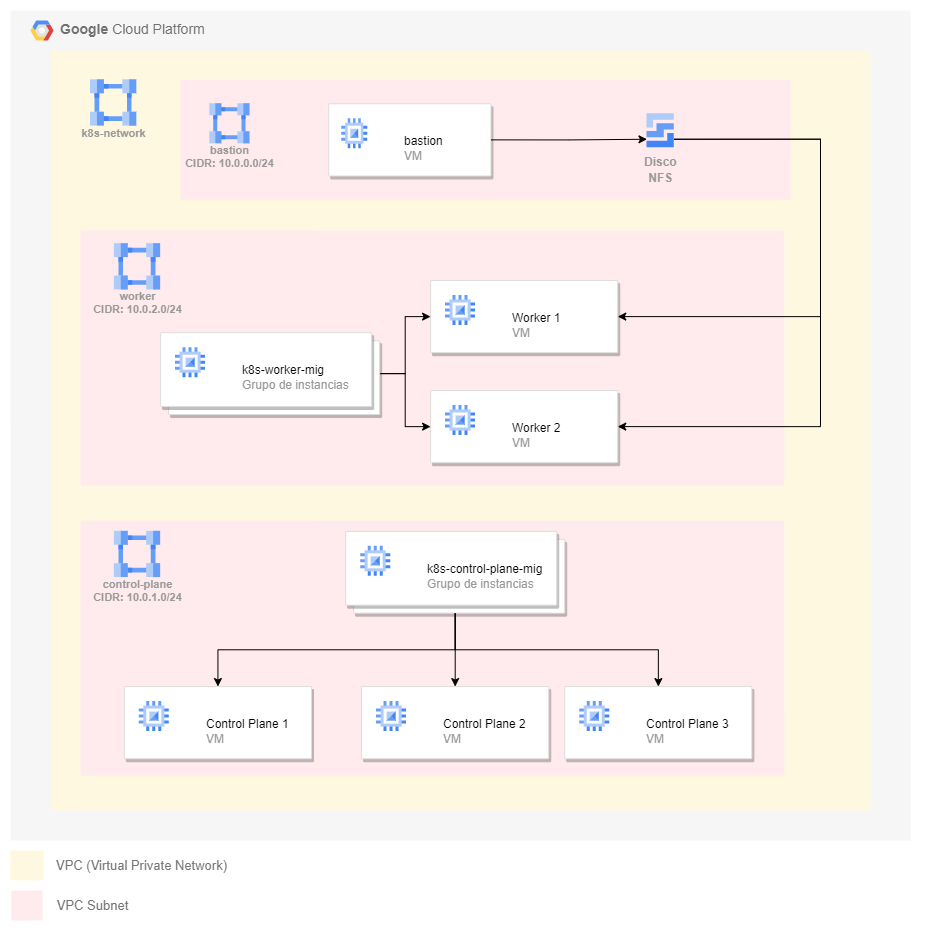
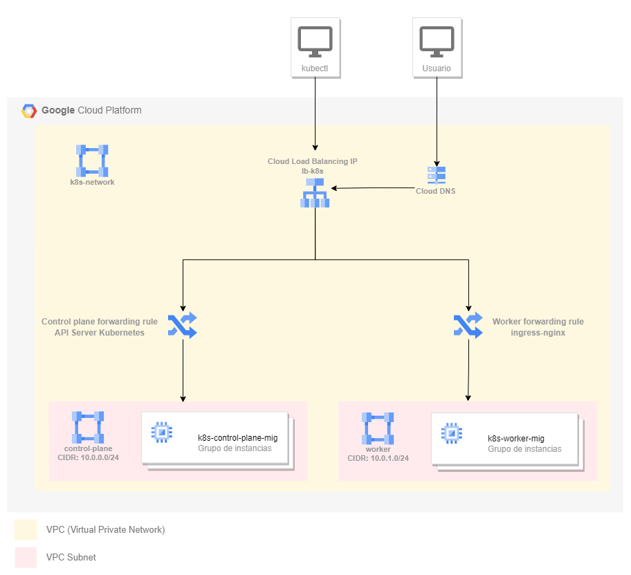

# Trabajo de Fin de Máster
Este repositorio contiene el código fuente del Trabajo de Fin de Máster.

## Instalación
Para instalar este proyecto, sigue estos pasos:

* Clona el repositorio en tu máquina local.
* Instala las dependencias necesarias (Terraform, Ansible y Python).
* Ejecuta los scripts de configuración encontrados en `utilities`.

## Uso
Para usar este proyecto, sigue estos pasos:

* Asegúrate de que las credenciales de GCP están configuradas en la variable de entorno: `export GOOGLE_APPLICATION_CREDENTIALS="/path/to/serviceAccount.json"`
* Ejecuta el script principal `create-cluster.sh`.

## Arquitectura
Este proyecto despliega la siguiente arquitectura en GCP utilizando Terraform:

### Instancias

### Balanceador de carga

### Reglas de Firewall

| Nombre de la regla | Protocolos permitidos | Puertos permitidos | Origen | Destino |
| --- | --- | --- | --- | --- |
| ssh-bastion-external | TCP | 22 | 0.0.0.0/0 | Bastion |
| ssh-internal | TCP | 22 | Bastion | Plano de control / Worker |
| kubernetes-api-server | TCP | 6443 | 0.0.0.0/0 | Plano de control |
| allow-all-internal (control plane) | TCP / UDP / ICMP / IPIP | Todos | Plano de control | Plano de control |
| allow-all-internal (worker) | TCP / UDP / ICMP / IPIP | Todos | Worker | Worker |
| allow-kubelet-api | TCP | 10250 | Plano de control / Worker | Plano de control / Worker |
| allow-nodeport-services | TCP | 30000-32767 | Plano de control / Worker | Plano de control / Worker |
| allow-calico-internal | TCP / ICMP / IPIP | 179, 2379, 5473 | Plano de control / Worker | Plano de control / Worker |
| nfs-server | TCP / UDP | 111, 2049 | Worker / Bastion | Worker / Bastion |
| ingress-nginx	| TCP	| 31215	| 0.0.0.0/0	| Trabajadores |

## Terraform
Se han creado diferentes módulos para desplegar la arquitectura anterior:
* VPC
* Firewall
* Disks
* Instances
* Load Balancer
* DNS

## Ansible
Este proyecto utiliza dos roles de Ansible:

`deploy-cluster`: Este rol se encarga de desplegar el clúster de Kubernetes.

`customize-cluster`: Este rol se encarga de personalizar el clúster de Kubernetes.
Sistema de auto-recuperación

## Sistema de auto-recuperación
La arquitectura es la mostrada en la siguiente imagen:

## Tecnologías utilizadas
Este proyecto utiliza las siguientes tecnologías:
* Ansible
* Terraform
* Kubernetes
* Python
* Bash
